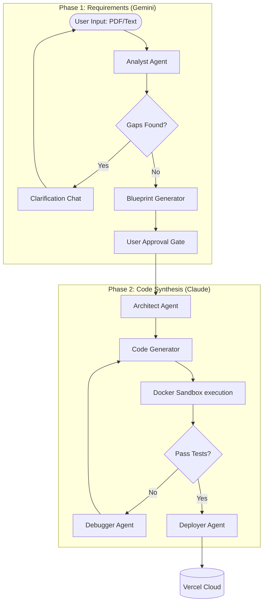

<div align="center">
  
</div>

<p align="center">
  
  
  
  
  
  
</p>

> **DeMaestro** is an Agentic AI platform that generates complete, runnable full-stack web applications directly from natural language requirements or PDF documents. 

By orchestrating specialized AI agents (Gemini and Claude) through a fully automated and containerized pipeline, DeMaestro handles everything from requirements extraction and interactive clarification to code synthesis, iterative debugging, and one-click cloud deployment.

---

## ✨ Features

- 📄 **Document Ingestion:** Upload PDF requirement documents or paste raw text. PyMuPDF and Gemini extract, parse, and structure the data.
- 💬 **Interactive Clarification Chat:** Gemini acts as a Requirements Analyst, asking targeted questions to fill logic gaps before locking in the blueprint.
- ⚙️ **Automated Agentic Pipeline:** Claude acts as the Code Engineer, running a multi-stage state machine: `Architect → Generator → Tester → Debugger → Verifier → Deployer`.
- 🛡️ **Hardened Docker Sandbox:** All generated code is executed, tested, and verified inside isolated Docker containers to ensure safety and runtime correctness.
- 🔁 **Iterative Debug Loop:** The Debugger agent autonomously patches import errors, missing endpoints, and runtime crashes across multiple verification cycles.
- 🚀 **One-Click Deployment:** Automatically provisions and deploys the finished, fully-tested full-stack application to **Vercel** via API integration.
---
---
## 📸 Screenshots

| Clarification Chat | Live Generation Progress |
|:---:|:---:|
|  |  |
---

---
## 🏗️ Multi-Agent Architecture

The backend orchestrates a sophisticated pipeline where different LLMs handle specialized roles.



---

## 🚀 Quick Start

Ensure you have **Docker**, **Node.js**, and **Python 3.11+** installed.

### 1. Configure Environment
```bash
cp frontend/.env.example frontend/.env
cp backend/.env.example backend/.env
```
*Fill in your Firebase credentials, `GEMINI_API_KEY`, and `ANTHROPIC_API_KEY`.*

### 2. Install Dependencies
**Frontend:**
```bash
cd frontend && npm install
```
**Backend:**
```bash
cd backend 
python3 -m venv .venv
source .venv/bin/activate
pip install -r requirements.txt
```

### 3. Run the Services
Start the development servers in two separate terminals:
```bash
# Terminal 1 - Frontend (React/Vite)
cd frontend && npm run dev          # Runs on http://localhost:5173

# Terminal 2 - Backend (FastAPI)
cd backend && uvicorn app.main:app --reload   # Runs on http://localhost:8000
```

---

## 📁 Project Structure

```text
demaestro/
├── frontend/                # React 18, Vite, Tailwind CSS, TanStack Query
│   ├── src/api/             # Axios client + domain helpers
│   ├── src/components/      # Reusable UI (ActiveGenerationBanner, etc.)
│   └── src/pages/           # Routing (ProjectChat, ProjectGeneration, etc.)
│
├── backend/                 # FastAPI, Firebase Admin, Docker SDK
│   ├── app/routes/          # REST endpoints (auth, requirements, pipeline)
│   ├── app/services/        # Cloud Storage, Vercel Deployer, PyMuPDF
│   ├── app/pipeline/        # Code generation state machine & checklist logic
│   ├── app/sandbox/         # Docker container lifecycle management
│   └── app/ai/              # Agent prompts and orchestration logic
│       ├── gemini/agents/   # Analyst, Clarification, Validator
│       └── claude/agents/   # Architect, Generator, Tester, Debugger
│
└── docker-compose.yml       # Local database & sandbox convenience
```

---

## 🔌 Core API Overview

| Endpoint | Method | Description |
|---|---|---|
| `/projects/:id/requirements` | `POST` | Submit raw requirements via PDF upload or text |
| `/projects/:id/requirements/chat`| `POST` | Send answers to the Gemini clarification agent |
| `/projects/:id/generate` | `POST` | Start the Claude automated code synthesis pipeline |
| `/projects/:id/generation/status`| `GET` | Polling endpoint for real-time WebSocket-like UI updates |
| `/projects/:id/deploy` | `POST` | Trigger automated Vercel deployment of generated code |

---

## 🧪 Testing

The backend is hardened with over 50+ test files covering pipeline logic, agent interactions, and sandbox execution.

```bash
cd backend
source .venv/bin/activate
pytest
```

---

## 🎓 About

**Capstone Project (Phase B)** — Software Engineering Department, Braude College of Engineering. <br/>
Developed by: **Owise Zoubi** & **Mohamad Atamleh** <br/>
Advisor: Dr. Natali Levi
